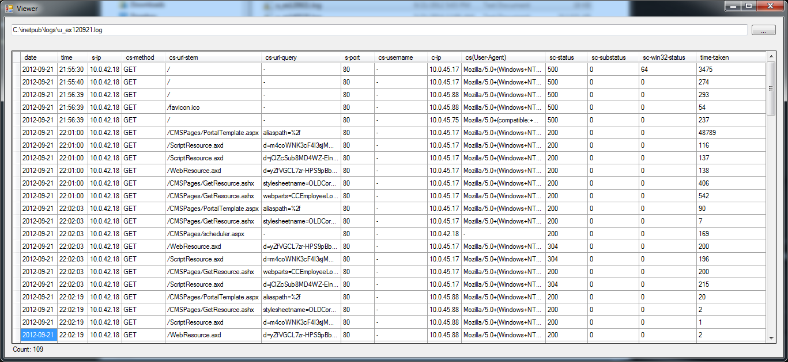

IISLogViewer
============

Simple Viewer for IIS Log Files. Browse to and open a log file for easy reading.

Easily opens up logs with 1.2 million lines (though it takes 40 seconds or so)

It currently has been tested with the W3C format, UTF-8 Encoding. The logging fields used do not matter since it parses that from the log file header.

It has not been tested on log files that have had the logging fields change though there is a check for that.

Added - Can now return a distinct list (text) of items in a column or dictinct count (grid).